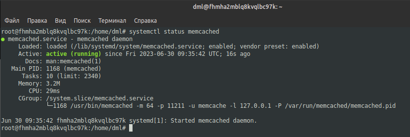
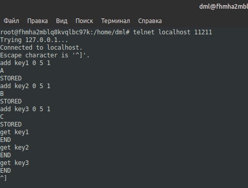
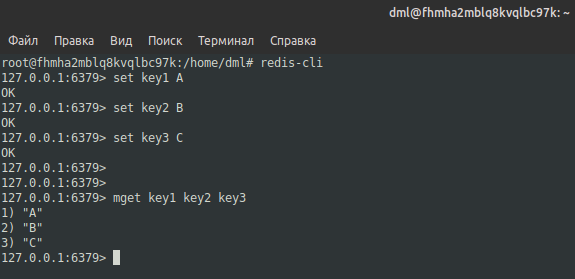
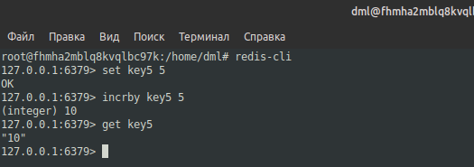

# 11.02. Кеширование Redis/memcached - Лебедев Д.С.

### Задание 1. Кеширование
> Приведите примеры проблем, которые может решить кеширование.
> *Приведите ответ в свободной форме.*

*Ответ:*  
- Низкая производительность и скорость ответа на запросы к БД - данные, к которым чаще обращаются, берутся из кеша, без повторных запросов непосредственно к базе данных;
- Экономия ресурсов базы данных, так как исключаются "тяжелые" запросы;
- Сглаживание бустов трафика в определённые периоды, когда предполагается значительное увеличение трафика.

### Задание 2. Memcached
> Установите и запустите memcached.
> *Приведите скриншот systemctl status memcached, где будет видно, что memcached запущен.*

*Ответ:*  
```sh
terraform apply
ssh dml@...
sudo su
apt update && apt install memcached telnet
```



### Задание 3. Удаление по TTL в Memcached
> Запишите в memcached несколько ключей с любыми именами и значениями, для которых выставлен TTL 5.
> *Приведите скриншот, на котором видно, что спустя 5 секунд ключи удалились из базы.*

*Ответ:*  


### Задание 4. Запись данных в Redis
> Запишите в Redis несколько ключей с любыми именами и значениями.
> *Через redis-cli достаньте все записанные ключи и значения из базы, приведите скриншот этой операции.*

*Ответ:*  
```sh
apt purge memcached
apt install redis
systemctl status redis
```



### Задание 5*. Работа с числами
> Запишите в Redis ключ key5 со значением типа "int" равным числу 5. Увеличьте его на 5, чтобы в итоге в значении лежало число 10.
> *Приведите скриншот, где будут проделаны все операции и будет видно, что значение key5 стало равно 10.*

*Ответ:*  
  

)))
```sh
terraform destroy
```
