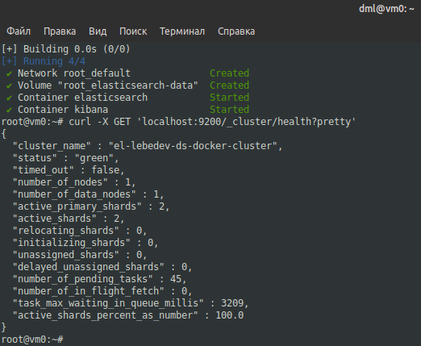
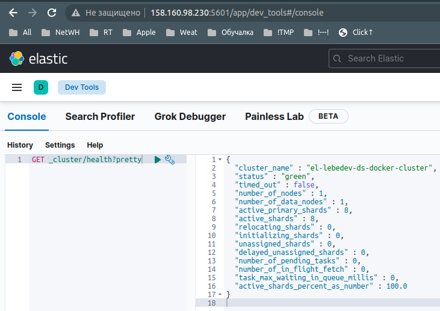
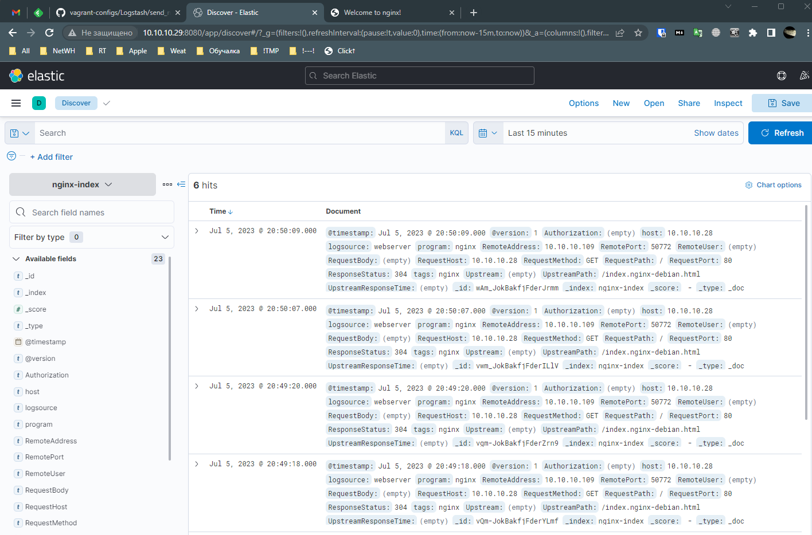
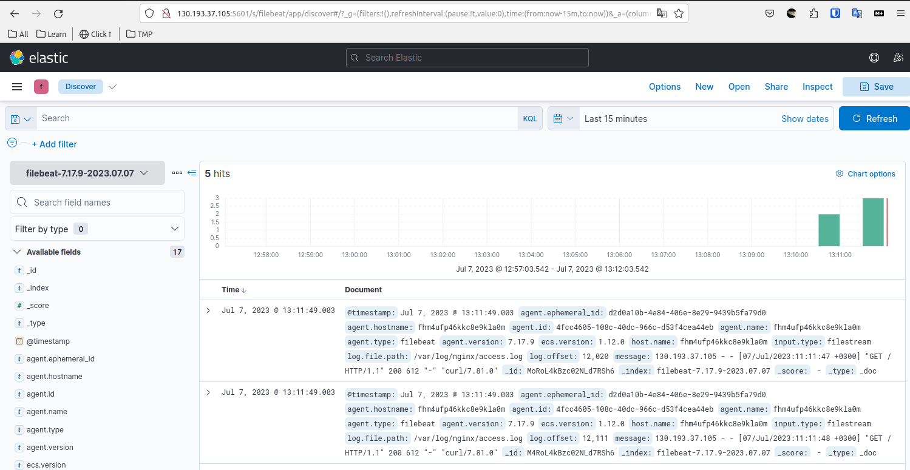
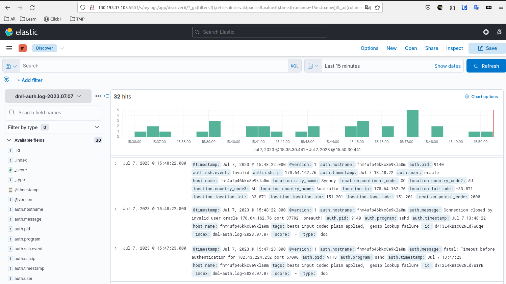

# 11.03. ELK - Лебедев Д.С.

### Задание 1. Elasticsearch
> Установите и запустите Elasticsearch, после чего поменяйте параметр cluster_name на случайный.
> *Приведите скриншот команды curl -X GET 'localhost:9200/_cluster/health?pretty', сделанной на сервере с установленным Elasticsearch, где будет виден нестандартный cluster_name.

*Ответ:*  
[Install Docker CE and Docker Compose on Debian](https://computingforgeeks.com/install-docker-and-docker-compose-on-debian/)
Установка Elasticsearch и Kibana в docker-контейнерах. Имя кластера задано через описание в файле `docker-compose.yml`  



### Задание 2. Kibana
> Установите и запустите Kibana.
> *Приведите скриншот интерфейса Kibana на странице http://<ip вашего сервера>:5601/app/dev_tools#/console, где будет выполнен запрос GET /_cluster/health?pretty

*Ответ:*  
Результат выполнения запроса GET   


### Задание 3. Logstash
> Установите и запустите Logstash и Nginx. С помощью Logstash отправьте access-лог Nginx в Elasticsearch.
> *Приведите скриншот интерфейса Kibana, на котором видны логи Nginx.*

*Ответ:*  
Для этого задания ВМ создавались с помощью vagrant. ВМ с nginx + ВМ с ELK. Порт Kibana для удобства изменён на 8080.  
Конфигурация nginx:  
```sh
events {
        worker_connections 1024;
}

http {
        include /etc/nginx/mime.types;
        include /etc/nginx/conf.d/*.conf;
        include /etc/nginx/sites-enabled/default;
        default_type application/octet-stream;
        log_format json escape=json
                '{'
                        '"Authorization":"$http_authorization",'
                        '"RequestTime":"$time_iso8601",'
                        '"RemoteAddress":"$remote_addr",'
                        '"RemotePort":"$remote_port",'
                        '"RemoteUser":"$remote_user",'
                        '"RequestHost":"$host",'
                        '"RequestPort":"$server_port",'
                        '"RequestMethod":"$request_method",'
                        '"RequestPath":"$request_uri",'
                        '"RequestBody":"$request_body",'
                        '"ResponseStatus":"$status",'
                        '"Upstream":"$upstream_addr",'
                        '"UpstreamPath":"$uri",'
                        '"UpstreamResponseTime":"$upstream_response_time"'
                '}';
        access_log syslog:server=10.10.10.29:5555 json;
}
```

Конфигурация logstash:  
```sh
input {
  syslog {
    port => 5555
    tags => "nginx"
  }
}
filter{
    json{
        source => "message"
    }
    date {
       match  => ["RequestTime","ISO8601"]
    }
    mutate {
        remove_field => ["message","timestamp","RequestTime","facility","facility_label","severity","severity_label","priority"]
    }
}
output {
if [program] == "nginx" {
    elasticsearch {
      hosts => ["http://localhost:9200"]
      index => "nginx-index"
    }
  }
}
```

Скриншот kibana с логами nginx от logstash:  



### Задание 4. Filebeat.
> Установите и запустите Filebeat. Переключите поставку логов Nginx с Logstash на Filebeat.
> *Приведите скриншот интерфейса Kibana, на котором видны логи Nginx, которые были отправлены через Filebeat.*

*Ответ:*  
Файл конфигурации Filebeat:  
```sh
filebeat.inputs:
- type: filestream
  enabled: true
  paths:
    - /var/log/nginx/access.log

output.elasticsearch:
  hosts: ["http://localhost:9200"]
  indices:
    - index: "filebeat-%{[agent.version]}-%{+yyyy.MM.dd}"
```

Скриншот kibana с логами nginx от Filebeat:  


### Задание 5*. Доставка данных
> Настройте поставку лога в Elasticsearch через Logstash и Filebeat любого другого сервиса , но не Nginx. Для этого лог должен писаться на файловую систему, Logstash должен корректно его распарсить и разложить на поля.
> *Приведите скриншот интерфейса Kibana, на котором будет виден этот лог и напишите лог какого приложения отправляется.*

*Ответ:*  
Для выполнения задания выбран файл auth.log, в котором представлена информация об авторизации пользователей, включая удачные и неудачные попытки входа в систему, а также задействованные механизмы аутентификации.

Конфигурация Filebeat:  
```sh
ilebeat.inputs:
- type: log
  enabled: true
  paths:
    - /var/log/auth.log

processors:
  - drop_fields:
      fields: ["agent", "ecs", "input", "log"]

output.logstash:
  hosts: ["localhost:5044"]
```

Конфигурация Logstash:  
```sh
input {
  beats {
    port => 5044
  }
}

filter {
  grok {
    match => { "message" => ["%{SYSLOGTIMESTAMP:[auth][timestamp]} %{SYSLOGHOST:[auth][hostname]} sshd(?:\[%{POSINT:[auth][pid]}\])?: %{DATA:[auth][ssh][event]} %{DATA:[auth][ssh][method]} for (invalid user )?%{DATA:[auth][user]} from %{IPORHOST:[auth][ssh][ip]} port %{NUMBER:[auth][ssh][port]} ssh2(: %{GREEDYDATA:[auth][ssh][signature]})?", "%{SYSLOGTIMESTAMP:[auth][timestamp]} %{SYSLOGHOST:[auth][hostname]} sshd(?:\[%{POSINT:[auth][pid]}\])?: %{DATA:[auth][ssh][event]} user %{DATA:[auth][user]} from %{IPORHOST:[auth][ssh][ip]}", "%{SYSLOGTIMESTAMP:[auth][timestamp]} %{SYSLOGHOST:[auth][hostname]} sshd(?:\[%{POSINT:[auth][pid]}\])?: Did not receive identification string from %{IPORHOST:[auth][ssh][dropped_ip]}", "%{SYSLOGTIMESTAMP:[auth][timestamp]} %{SYSLOGHOST:[auth][hostname]} sudo(?:\[%{POSINT:[auth][pid]}\])?: \s*%{DATA:[auth][user]} :( %{DATA:[auth][sudo][error]} ;)? TTY=%{DATA:[auth][sudo][tty]} ; PWD=%{DATA:[auth][sudo][pwd]} ; USER=%{DATA:[auth][sudo][user]} ; COMMAND=%{GREEDYDATA:[auth][sudo][command]}", "%{SYSLOGTIMESTAMP:[auth][timestamp]} %{SYSLOGHOST:[auth][hostname]} groupadd(?:\[%{POSINT:[auth][pid]}\])?: new group: name=%{DATA:system.auth.groupadd.name}, GID=%{NUMBER:system.auth.groupadd.gid}", "%{SYSLOGTIMESTAMP:[auth][timestamp]} %{SYSLOGHOST:[auth][hostname]} useradd(?:\[%{POSINT:[auth][pid]}\])?: new user: name=%{DATA:[auth][useradd][name]}, UID=%{NUMBER:[auth][useradd][uid]}, GID=%{NUMBER:[auth][useradd][gid]}, home=%{DATA:[auth][useradd][home]}, shell=%{DATA:[auth][useradd][shell]}$", "%{SYSLOGTIMESTAMP:[auth][timestamp]} %{SYSLOGHOST:[auth][hostname]} %{DATA:[auth][program]}(?:\[%{POSINT:[auth][pid]}\])?: %{GREEDYMULTILINE:[auth][message]}"] }
    pattern_definitions => { "GREEDYMULTILINE"=> "(.|\n)*" }

    remove_field => "message"
  }
      
  date {
    match => [ "[auth][timestamp]", "MMM  d HH:mm:ss", "MMM dd HH:mm:ss" ]
  }

  geoip {
    source => "[auth][ssh][ip]"
    target => "[location]"
  }
}

output {
  elasticsearch {
    hosts => ["http://localhost:9200"]
    index => "dml-auth.log-%{+YYYY.MM.dd}"
  }
}
```

Скриншот auth.log:  


